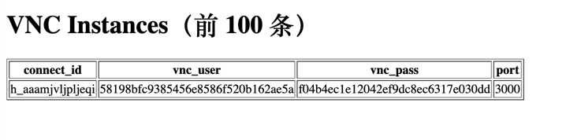

### KasmVNC Proxy


#### 前提需要

* 容器网络需要在一个网络设备上。
* 需要有一个pg数据库，存储vnc的连接信息。


#### 提供了一种思路


* 使用pg作为管理db可以对外免密码访问，可以修改`homepage.lua`实现`readonly`
* http://XXXXX:28881/test_vncs



> 你可以自己修改`db_utils.lua`里面的db相关的数据，改造成你的db授权即可。
> http://xxxx:28881/proxy/?connect_id=h_aaamjvljpljeqi
> http://xxxx:28881/vnc_player?connect_id=h_aaamjvljpljeqi


* sql 

```sql

CREATE TABLE kasm_vnc (
    connect_id VARCHAR(255) PRIMARY KEY,   -- 用作查询的唯一标识
    vnc_user   VARCHAR(255) NOT NULL,      -- VNC 登录用户名
    vnc_pass   VARCHAR(255) NOT NULL,      -- VNC 登录密码
    port       INTEGER      NOT NULL       -- VNC 服务端口
);

```